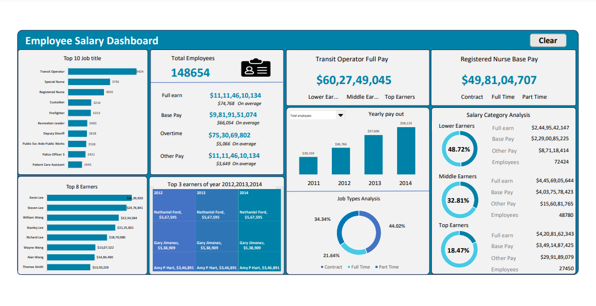

# Employee Salary Analysis Dashboard – Excel Project

## Overview  
This Excel dashboard project analyzes employee salary data from the **San Francisco City Government (2011–2014)**. The raw dataset was cleaned, transformed, and visualized using Excel formulas, macros, and pivot charts to uncover salary patterns, top earning roles, and workforce distribution. The goal was to build an interactive and insightful tool for HR professionals and data analysts.

---
## Download Excel Dashboard (.xlsm):

- [Download from GitHub Releases](https://github.com/Rutujakarne22/Employee_Salary_Analysis/releases/tag/v1.0)

---

## Problem Statement  
The HR and payroll departments maintain large volumes of employee salary data, but the raw format often contains inconsistencies, blanks, duplicates, and poor structure. Without proper data organization, data teams struggle to derive timely and accurate reports for management decisions.

This project aims to transform raw payroll data into a clean, structured, and interactive Excel dashboard that supports HR executives and management in identifying salary trends, employee counts, high-cost roles, and workforce distribution across job types and salary categories.

---

## Objective  
To clean, analyze, and visualize employee salary data using Excel so that decision-makers and HR analysts can understand pay distribution, identify high-earning roles, monitor workforce types, and support compensation planning.

---

## Tools & Techniques Used  
- Microsoft Excel  
- Excel formulas (`TRIM`, `PROPER`, `IF`, `SUM`, `SUBSTITUTE`, etc.)  
- Pivot tables and charts  
- Slicers and KPI cards  
- Macros for reset/clear button  
- Created new columns like `Job Type` and `Salary Category`  

---

## Insights

1. **Total payout (2011–2014)** crossed $11 billion, with Base Pay forming ~88% of the total.  
2. **Transit Operators** and **Nursing staff** were among the most employed roles.  
3. The **top 3 earners remained consistent** across all 4 years.  
4. **Full-time roles** make up just under 50% of the workforce; contract and part-time together exceed 50%.  
5. Around **49% of employees** fall into the **middle earning** salary bracket.  
6. **Overtime payouts** are significant in public service roles like Transit Operators and Firefighters.  
7. Clear yearly increase in total salary per employee indicates growing compensation or headcount.

---

## Recommendations  
- Evaluate the concentration of salary spending in public-facing roles for budgeting.  
- Review pay structures for lower earners making up nearly one-third of the workforce.  
- Use the dashboard filters to analyze trends by year, role, or employment type for better HR planning.  
- Improve data collection standards to reduce time spent on cleaning and formatting.

---

## Dashboard Preview
---

